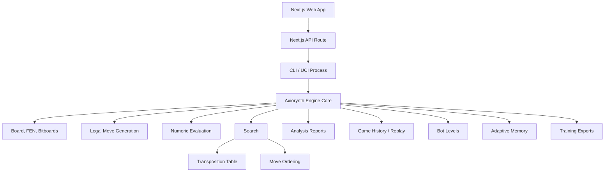

# Axiorynth

> A math-first, traceable Rust chess engine built to grow from correct rules into serious research-grade play.

[](https://www.rust-lang.org/)
[](https://www.chessprogramming.org/UCI)
[](docs/master-implementation-plan.md)

Axiorynth is a custom chess engine and local chess platform. It is designed
around three principles:

- **Correctness first**: legal move generation is verified by perft suites.
- **Visible intelligence**: evaluation and search expose real numeric math.
- **Research path**: the codebase is structured for stronger search, tuning, self-play, and future NNUE work.

This is not a Stockfish-class engine yet. It is a serious foundation built in
phases, with UCI support, search, analysis reports, bot levels, game history,
adaptive memory, research-roadmap artifacts, and a Next.js play app already in
place.

## Highlights

- Rust engine core with bitboards
- FEN parse/export
- legal move generation
- castling, en passant, promotions
- make/undo with compact undo records
- Zobrist hashing
- perft and divide
- numeric evaluation breakdown
- negamax alpha-beta search
- quiescence search
- transposition table
- hash move ordering
- killer moves and history heuristic
- UCI protocol support
- per-depth UCI `info` streaming
- benchmark command
- structured analysis reports
- game history and replay
- bot levels 1 to 10
- adaptive player memory
- training/export reports
- research roadmap for future strength work
- Next.js frontend
- interactive chessboard
- human vs human and human vs bot modes
- side panel with actual numeric math
- legal possibilities panel
- replay controls
- browser-local saved game archive

## Quick Start

From the repo root:

```powershell
cargo test
```

Run the engine in UCI mode:

```powershell
cargo run -p axiorynth_engine --bin axiorynth -- uci
```

Ask for a best move:

```powershell
cargo run -p axiorynth_engine --bin axiorynth -- best startpos 3
```

Analyze a position with real math:

```powershell
cargo run -p axiorynth_engine --bin axiorynth -- analyze startpos 2
```

Run a small benchmark:

```powershell
cargo run -p axiorynth_engine --bin axiorynth -- bench 3
```

Run the web app:

```powershell
npm.cmd install
npm.cmd run web:dev
```

Then open:

```text
http://127.0.0.1:3000
```

## CLI Commands

```powershell
cargo run -p axiorynth_engine --bin axiorynth -- eval startpos
cargo run -p axiorynth_engine --bin axiorynth -- best startpos 3
cargo run -p axiorynth_engine --bin axiorynth -- perft startpos 3
cargo run -p axiorynth_engine --bin axiorynth -- bench 3
cargo run -p axiorynth_engine --bin axiorynth -- analyze startpos 2
cargo run -p axiorynth_engine --bin axiorynth -- bot 5 startpos
cargo run -p axiorynth_engine --bin axiorynth -- game e2e4 e7e5 g1f3
cargo run -p axiorynth_engine --bin axiorynth -- memory e2e4 e7e5
cargo run -p axiorynth_engine --bin axiorynth -- train e2e4 e7e5
cargo run -p axiorynth_engine --bin axiorynth -- frontend-state --bot-level 3 --depth 2 e2e4 e7e5
cargo run -p axiorynth_engine --bin axiorynth -- roadmap
```

Running without arguments starts the UCI protocol loop:

```powershell
cargo run -p axiorynth_engine --bin axiorynth
```

## Example Analysis Output

```text
Axiorynth analysis report
fen: rnbqkbnr/pppppppp/8/8/8/8/PPPPPPPP/RNBQKBNR w KQkq - 0 1
legal move count: 20
legal moves: a2a3 a2a4 b1a3 b1c3 ...

Evaluation math
material: 4000 - 4000 = +0
piece-square: -75 - -75 = +0
mobility: (20 - 20) * 2 = +0
center: 0 - 0 = +0
pawn structure: 0 - 0 = +0
king safety: 18 - 18 = +0
total: +0 centipawns from White perspective

Search math
search depth: 2
best move: d2d4
score: +12 centipawns
principal variation: d2d4 d7d5
main nodes: ...
quiescence nodes: ...
transposition table: ...
candidate 1: ...
```

## Architecture



## Repository Layout

```text
chess/
  Cargo.toml
  package.json
  README.md
  apps/
    web/
      app/
        api/state/route.ts
        page.tsx
        globals.css
  docs/
    master-implementation-plan.md
    phase-1-engine-foundation.md
    phase-2-first-bot-search.md
    phase-3-uci-protocol.md
    phase-4-strength-and-performance.md
    phase-5-analysis-report-layer.md
    phase-6-to-10-engine-completion.md
  engine/
    Cargo.toml
    src/
      analysis.rs
      bench.rs
      board.rs
      bot.rs
      eval.rs
      game.rs
      memory.rs
      movegen.rs
      mv.rs
      perft.rs
      research.rs
      search.rs
      training.rs
      types.rs
      uci.rs
      zobrist.rs
      bin/
        axiorynth.rs
```

## Phase Status

| Phase | Name | Status |
|---:|---|---|
| 1 | Engine foundation | Complete |
| 2 | First bot search | Complete |
| 3 | UCI protocol | Complete |
| 4 | Strength and performance | Complete |
| 5 | Analysis report layer | Complete |
| 6 | Game history and replay | Complete |
| 7 | Bot levels | Complete |
| 8 | Adaptive memory | Complete |
| 9 | Training/export reports | Complete |
| 10 | Research roadmap artifacts | Complete |
| 11 | Local Next.js play app | Complete |

Read the full plan here:

- [Master Implementation Plan](docs/master-implementation-plan.md)
- [Next Plans And Current Limitations](docs/next-plans-and-current-limitations.md)

## Engine Systems

### Move Generation

Axiorynth uses a correctness-first legal move pipeline:

```text
generate pseudo-legal moves
make each move
check king safety
undo the move
keep legal moves
```

Perft tests cover standard and tricky positions, including Kiwipete,
promotion-heavy positions, tactical middlegames, castling, and en passant.

### Evaluation

Current evaluation terms:

- material
- piece-square tables
- mobility
- center control
- pawn structure
- king safety

The evaluator returns structured math lines for UI/backend consumption.

### Search

Current search features:

- negamax
- alpha-beta pruning
- quiescence search
- iterative deepening
- transposition table
- hash move ordering
- killer moves
- history heuristic
- mate scoring
- candidate ranking
- principal variation output
- stop/time/node limits

### UCI

Axiorynth supports standard GUI-style commands:

```text
uci
isready
ucinewgame
position startpos
position fen ...
go depth N
go movetime N
go wtime ... btime ...
go nodes N
go infinite
stop
quit
```

## Testing

Run:

```powershell
cargo test
```

Current verified status:

```text
40 tests passed
0 failed
```

Tests cover:

- FEN round trips
- legal move generation
- perft reference positions
- compact undo hash restoration
- Zobrist determinism
- alpha-beta search behavior
- mate-in-one detection
- transposition table usage
- UCI parsing
- analysis reports
- game replay
- bot levels
- adaptive memory
- training exports
- research roadmap generation

## Web App

The web app is a local full-stack interface:

- custom chessboard
- self-play mode
- human vs bot mode
- bot level selector
- analysis depth selector
- legal move list
- move history
- replay slider
- saved game archive in browser local storage
- visible evaluation and search math

The frontend calls the Rust engine through:

```text
Next.js API route -> cargo run -> axiorynth frontend-state -> JSON response
```

This keeps Rust as the source of chess truth while letting the app move quickly.

## Current Limitations

Axiorynth is not yet a top-engine-strength competitor. The current engine is a
well-structured research foundation with a complete local app layer.

Known limitations:

- no null-move pruning yet
- no late move reductions yet
- no aspiration windows yet
- no principal variation search yet
- no NNUE evaluator yet
- no opening book yet
- no tablebase support yet
- no persistent database yet
- no dedicated Rust HTTP service yet
- no WebSocket analysis stream yet
- no online multiplayer yet

## Next Plans

### 1. Backend API Layer

Build a local backend around the engine:

- start game
- make move
- request bot move
- analyze position
- store history
- stream search/math events

Recommended stack:

```text
Rust Axum backend
SQLite first
WebSocket analysis stream
```

### 2. Frontend Expansion

Expand the current user-facing chess app:

- drag-and-drop pieces
- promotion chooser
- history page
- opening explorer
- training review mode
- streamed search panel
- richer game archive

Recommended stack:

```text
Next.js + TypeScript
Rust Axum API
WebSocket analysis stream
```

### 3. Engine Strength Phase

Add deeper search systems:

- principal variation search
- aspiration windows
- null-move pruning
- late move reductions
- futility pruning
- static exchange evaluation
- better time management

### 4. Data And Learning Phase

Make adaptive memory persistent:

- SQLite player profiles
- opening tendencies
- repeated mistakes
- win/loss history
- replay-derived training notes
- bot adaptation settings

### 5. Research Phase

Build the scientific loop:

- self-play runner
- gauntlet runner
- Elo estimation
- SPSA tuning
- opening book generation
- NNUE feature extraction prototype

## Philosophy

Axiorynth is not trying to look intelligent from the outside while hiding the
numbers. It is built so the user can inspect the engine's actual reasoning:

```text
What moves were legal?
What did the evaluator score?
Which candidates were searched?
How many nodes were visited?
What did alpha-beta prune?
Which line became the principal variation?
```

That traceability is the soul of the project.
