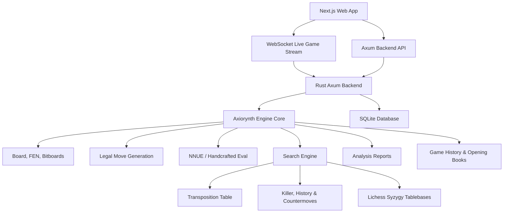

# Axiorynth

> A math-first, traceable Rust chess engine built to grow from correct rules into serious research-grade play.

[](https://www.rust-lang.org/)
[](https://www.chessprogramming.org/UCI)
[](docs/master-implementation-plan.md)

Axiorynth is a custom chess engine and competitive multiplayer chess platform. It is designed around three principles:

- **Correctness first**: Legal move generation is verified by extensive perft suites.
- **Visible intelligence**: Evaluation and search expose real numeric math live to the user.
- **Scientific research**: The codebase is structured for SPSA optimization, self-play, opening books, tablebases, and deep neural evaluations (NNUE).

## Highlights

- **Rust Engine Core**: Bitboard representation, Zobrist hashing, and perft suites.
- **Tactical Search**: Negamax search, Alpha-Beta pruning, PV search, Aspiration windows, LMR, NMP, SEE, Singular & Check Extensions, and Countermove heuristics.
- **Machine Learning**: NNUE evaluation (sparse HalfKP input, fully connected layers) with a backpropagation training loop, weight persistence, and dataset generation.
- **Endgame Knowledge**: Direct Syzygy tablebase probing via Lichess HTTP API for positions with 7 or fewer pieces.
- **Opening Book**: Opening move generator from self-play lists and automatic bot probing.
- **Axum API Server**: Session-based user authentication, ratings parity matchmaking, and real-time live game Websockets.
- **Next.js Web App**: Offline bot play with active math streaming, and online multiplayer matches with real-time play, pawn promotions, resignation, and spectator support.

## Quick Start

From the repo root:

```powershell
cargo test
```

Run the engine in UCI mode:

```powershell
cargo run -p axiorynth_engine --bin axiorynth -- uci
```

Ask for a best move:

```powershell
cargo run -p axiorynth_engine --bin axiorynth -- best startpos 3
```

Analyze a position with real math:

```powershell
cargo run -p axiorynth_engine --bin axiorynth -- analyze startpos 2
```

## CLI Commands

```powershell
cargo run -p axiorynth_engine --bin axiorynth -- eval startpos
cargo run -p axiorynth_engine --bin axiorynth -- best startpos 3
cargo run -p axiorynth_engine --bin axiorynth -- perft startpos 3
cargo run -p axiorynth_engine --bin axiorynth -- bench 3
cargo run -p axiorynth_engine --bin axiorynth -- analyze startpos 2
cargo run -p axiorynth_engine --bin axiorynth -- bot 5 startpos
cargo run -p axiorynth_engine --bin axiorynth -- game e2e4 e7e5 g1f3
cargo run -p axiorynth_engine --bin axiorynth -- memory e2e4 e7e5
cargo run -p axiorynth_engine --bin axiorynth -- train e2e4 e7e5
cargo run -p axiorynth_engine --bin axiorynth -- roadmap
cargo run -p axiorynth_engine --bin axiorynth -- self-play
cargo run -p axiorynth_engine --bin axiorynth -- spsa-tune
cargo run -p axiorynth_engine --bin axiorynth -- load-config
cargo run -p axiorynth_engine --bin axiorynth -- gauntlet <games> <depth_a> <depth_b>
cargo run -p axiorynth_engine --bin axiorynth -- book-gen <num_games> <depth>
cargo run -p axiorynth_engine --bin axiorynth -- book-probe <fen_or_startpos>
cargo run -p axiorynth_engine --bin axiorynth -- nnue-gen <games> <depth>
cargo run -p axiorynth_engine --bin axiorynth -- nnue-train <data-file> <epochs>
```

Running without arguments starts the UCI protocol loop.

## Example Analysis Output

```text
Axiorynth analysis report
fen: rnbqkbnr/pppppppp/8/8/8/8/PPPPPPPP/RNBQKBNR w KQkq - 0 1
legal move count: 20
legal moves: a2a3 a2a4 b1a3 b1c3 ...

Evaluation math
material: 4000 - 4000 = +0
piece-square: -75 - -75 = +0
mobility: (20 - 20) * 2 = +0
center: 0 - 0 = +0
pawn structure: 0 - 0 = +0
king safety: 18 - 18 = +0
total: +0 centipawns from White perspective

Search math
search depth: 2
best move: d2d4
score: +12 centipawns
principal variation: d2d4 d7d5
main nodes: ...
quiescence nodes: ...
transposition table: ...
candidate 1: ...
```

## Architecture



## Phase Status

| Phase | Name | Status |
|---:|---|---|
| 1 | Engine foundation | Complete |
| 2 | First bot search | Complete |
| 3 | UCI protocol | Complete |
| 4 | Strength and performance | Complete |
| 5 | Analysis report layer | Complete |
| 6 | Game history and replay | Complete |
| 7 | Bot levels | Complete |
| 8 | Adaptive memory | Complete |
| 9 | Training/export reports | Complete |
| 10 | Research roadmap artifacts | Complete |
| 11 | Local Next.js play app | Complete |
| 12 | Stronger Backend Layer | Complete |
| 13 | Real-Time Math Streaming | Complete |
| 14 | Engine Time Management | Complete |
| 15 | Bot Learning and Mistakes | Complete |
| 16 | Engine Extensions (Singular & Check) | Complete |
| 17 | SPSA Tuning & Gauntlet Runner | Complete |
| 18 | Opening Book System | Complete |
| 19 | NNUE Pipeline & Backpropagation | Complete |
| 20 | Syzygy Tablebase Integration | Complete |
| 21 | Online Multiplayer Platform | Complete |

Read the full plans here:
- [Master Implementation Plan](docs/master-implementation-plan.md)
- [Next Plans And Current Limitations](docs/next-plans-and-current-limitations.md)

## Testing

Run:

```powershell
cargo test
```

Current verified status:

```text
45 tests passed
0 failed
```

Tests cover:
- FEN round trips
- Legal move generation
- Perft reference positions
- Zobrist hashing determinism
- Alpha-Beta & PV search behavior
- Transposition table hits
- Opening Book load/save and generation
- NNUE network forward pass and backpropagation training loss decay
- API endpoints & WebSocket multiplayer moves

## Web App

The web app is a full-stack Next.js interface:
- **Local Play**: Human vs human, human vs bot modes, bot levels, saved games, and live engine evaluation panels.
- **Online Play**: Stateful registration/login, competitive matchmaking queue, and real-time live game Websockets.
- **Spectating**: Click any ongoing game from the dashboard list to spectate live multiplayer play.

The frontend calls the Rust backend:
- REST API (Port 8080) for auth, matchmaking, profile info, and game history.
- WebSockets (Port 8080) for active bot searches and live game multiplayer moves.
